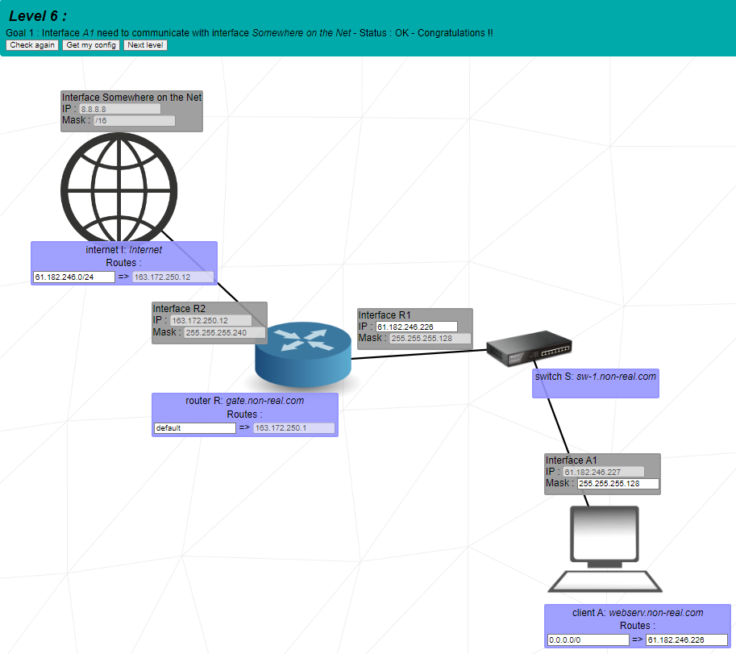

# NetPratice

Classes de ip
A   0     a   127 - 16.777.216 combinações
B   128   a   191 - 65.536 combinações
C   192   a   223 - 256 combinações
D   224   a   239 - (TESTES DE NOVAS TECNOLOGIAS)
E   240   a   255 - (MULTICASTS / UNICAST/ BROADCAST)

Estudo baseado nesse vídeo:
Redes 2 - IP, máscara de rede, gateway
(https://www.youtube.com/watch?v=yLgansF_h1w)

Um IP é composto por 32 bits 00000000.00000000.00000000.00000000 ou 4 octetos

Rede - envio de informações / envio de pacote de rede
    >Máscara da Rede (intervalo de IP que compõe uma rede)
Gateway - caminho que conecta uma rede em outra

Máscara da Rede (intervalo de IP que compõe uma rede)

### Entendendo a Rede

Alguns exemplos de divisão de rede e host, pelo uso de diferentes máscaras.

___________________________________ exemplo 1 __________________________________________________

Imagine uma rede  192.       168.         0.          1
                00000000.  00000000.   00000000.   00000000
Que usa essa máscara         redes               |  hosts (usuário final que recebe a rede)
Que usa essa máscara         redes (24 bits)     |  hosts (8 bits)

Nessa rede podemos ter HOSTS do IP    192.       168.         0.          0
ao (isso usa 8 bits que dá 256)       192.       168.         0.          255

De todos esses IPS do 192.168.0.0 ao 192.168.0.255 precisamos saber que o IP 192.168.0.0 não é atribuido a nenhum host ele é o IP DA REDE (ele que vai representar aquela rede), e o último ip, o 192.168.0.255 é chamado de IP BROADCAST, uma das máquinas da rede pode mandar info pra que as outras máquinas da mesma rede recebam; 
O QUE FAZ COM QUE TENHAMOS 254 HOSTS NESSA REDE

___________________________________ exemplo 2 __________________________________________________

Imagine uma rede  192.       168.         0.          1
                00000000.  00000000.   00000000.   00000000
Que usa essa máscara         redes                  |  hosts (usuário final que recebe a rede)
Que usa essa máscara         redes (25 bits)        |  hosts (7 bits)

Nessa rede podemos ter HOSTS do IP    192.       168.         0.          0
ao (isso usa 8 bits que dá 127)       192.       168.         0.          127

De todos esses IPS do 192.168.0.0 ao 192.168.0.127 precisamos saber que o IP 192.168.0.0 não é atribuido a nenhum host ele é o IP DA REDE (ele que vai representar aquela rede), e o último ip, o 192.168.0.127 é chamado de IP BROADCAST, uma das máquinas da rede pode mandar info pra que as outras máquinas da mesma rede recebam; 
O QUE FAZ COM QUE TENHAMOS 126 HOSTS NESSA REDE

Isso acaba criando uma sub_REDE de IPS do 192.168.0.128 ao 192.168.0.255 e que também tem 126 HOSTS NESSA REDE

___________________________________ exemplo 3 __________________________________________________

Imagine uma rede   10.        0.         0.          1 
E outra uma rede   10.        0.         2.          255 
                00000000.  00000000.   00000000.   00000000
Que usa essa máscara         redes            |  hosts (usuário final que recebe a rede)
Que usa essa máscara         redes (23 bits)  |  hosts (9 bits)

Nessa rede podemos ter HOSTS do IP    10.       0.         0.          0
ao (isso usa 9 bits que dá 512)       10.       0.         1.          255

De todos esses IPS do 10.0.0.0 ao 10.0.1.255 precisamos saber que o IP 192.168.0.0 não é atribuido a nenhum host ele é o IP DA REDE (ele que vai representar aquela rede), e o último ip, o 10.0.1.255 é chamado de IP BROADCAST, uma das máquinas da rede pode mandar info pra que as outras máquinas da mesma rede recebam; 
O QUE FAZ COM QUE TENHAMOS 512 HOSTS NESSA REDE

___________________________________ exemplo 4 __________________________________________________

A rede com a máscara de 22 bits pra REDE e 10 bits para os hosts de IPS do 10.0.0.0 ao 10.0.3.255 sendo que o IP 10.0.0.0 não é atribuido a nenhum host ele é o IP DA REDE (ele que vai representar aquela rede), e o último ip, o 10.0.3.255 é chamado de IP BROADCAST, FAZ COM QUE TENHAMOS 1022 HOSTS NESSA REDE (1024 tirando o nome da rede e o broadcast)

### Entendendo o Gateway

Duas máquinas 192.168.0.0 e 192.168.0.10, 
Imagine essa rede que usa essa máscara /24
Que usa essa máscara         redes (24 bits)     |  hosts (8 bits)

Logo essa rede vai do IP 192.168.0.0 ao 192.168.0.255, então essas máquinas podem se comunicar diretamente.

MAS

se uma dessas máquinas quer acessar um site na internet de IP 200.200.200.200 precisa passar pelo GATEWAY (que pode ser um modem, ou um roteador, ou mesmo um servidor de internet)

o GATEWAY conecta máquinas com redes FORA da rede delas.
O GATEWAY pode ser o primeiro IP válido de uma rede: 192.168.0.1
OU
o último IP válido 192.168.0.254

__________________________________________________________________________________________
### CConceitos do Projeto
O que é ser um host?

Host é todo e qualquer computador ou máquina ligada a uma rede por meio de um número de IP e domínio definido que tem como responsabilidade oferecer recursos, informações e serviços aos usuários. Também é conhecido como: hospedagem, hospedeiro ou anfitrião.

Máscara - Determina quantos ips eu tenho na minha rede

Gateway - Gateway pode ser classificado como “portal” ou “portão”. Ele é considerado uma passagem entre dois ambientes distintos. Ou ainda, em outras palavras, é um sistema ou equipamento encarregado de estabelecer a comunicação entre duas redes. Serve para fazer as comunicações entre as redes.

IP - endereço da rede.

Broadcast - é fazer uma transmissão de larga escala, comunicando com todos os dispositivos de uma mesma rede. “Broad” pode ser traduzido como amplo ou em larga escala; e “cast” pode ser traduzido como transmissão ou projeção

LoopBack - quando o computador se comunica com ele mesmo.

192.168... é uma rede privada para se comunicar com a internet precisa utilizar outros endereços de IP.

### Alguns Ips são reservados para Private Networks:
● 10.0.0.0 – 10.255.255.255
● 172.16.0.0 – 172.31.255.255
● 192.168.0.0 – 192.168.255.255
● 127.0.0.0 – 127.255.255.25

(existem vários outros, mas esses precisamos saber pra este projeto)
___________________________________________________________________________________________

## COMO FUNCIONA ESSE PROJETO:

Baixe o anexo da intra. Extraia o conteúdo para algum lugar. Clique em index.html.

Você terá 2 opções. 

1- Colocando seu login, você vai percorrer os exercícios do 1 ao 10, em ordem crescente.

    Resolva o exercício, salve a sua configuração clicando em "Get my config" e salve o .json desse exercício (você deverá entregar o .json de todos os exercícios do 1 ao 10).

2- Modo avaliação (sem colocar nada no login)

    Serão sorteados 3 exercícios do 6 ao 10, que você deverá fazer em 15 minutos. 
    Você pode treinar o modo avaliação quantas vezes você quiser.

___________________________________________________________________________________________

## COMO RESOLVER:

(os ips que aparecem aqui são só exemplos por que cada vez que você faz o exercicio os ips variam)
### LEVEL 1

- Copie o IP da Interface B1 para a Interface A1 aumentando 1 no valor do host: (104.94.23.12 + 1 = 104.94.23.13)

- Copie o IP da Interface C1 para a Interface D1 aumentando 1 no valor do host: (211.191.12.75 + 1 = 211.191.12.76)

(IPs de valor próximos tem mais chance de estarem na mesma rede)

> Deu tudo certo? clique em "Get my config" e salve o .json desse exercício (você deverá entregá-lo)

como ficou:

### LEVEL 2

- Copie a máscara de A1 para B1, agora ajuste o IP de B1 para A1 subtraindo 1 (192.168.98.222 - 1 = 192.168.98.221)

- Copie o IP de B1 para D1, e copie o IP de A1 para C1

> Deu tudo certo? clique em "Get my config" e salve o .json desse exercício (você deverá entregá-lo)

como ficou:

### LEVEL 3

- a máscara de C1 é fixa, então devemos usá-la nesse exercício. Copie a máscara de C1 em A1 e B1.

- o IP de A1 é fixo, então devemos usá-lo nesse exercício. Copie o IP de A1 em B1, subtraíndo 1, e copie novamente em C1, subtraíndo 2.
(IP de A1 - 104.198.89.125 / IP de B1 - 104.198.89.124 / IP de C1 - 104.198.89.123)

> Deu tudo certo? clique em "Get my config" e salve o .json desse exercício (você deverá entregá-lo)

como ficou:

### LEVEL 4

- o trio A1, B1 e R1 estão ligados no mesmo switch S: Switch-1, por isso precisam da mesma máscara.

- Copie a máscara de A1 em R1 e B1.

- o IP de A1 é fixo, então devemos usá-lo nesse exercício. Copie o IP de A1 em B1, somando 1, e copie novamente em C1, somando 2.
(IP de A1 - 97.36.115.132 / IP de B1 - 97.36.115.133 / IP de C1 - 97.36.115.134)

> Deu tudo certo? clique em "Get my config" e salve o .json desse exercício (você deverá entregá-lo)

como ficou:

### LEVEL 5

- Divida esse exercício em 2 partes. Rede de baixo e rede de cima, entre elas temos um roteador que conecta as duas redes.

PARTE 1
- O IP de R1 deve se o mesmo do client A. Ajuste a máscara do client A para "default". 
(   client A: Machine A
        Routes :
default => 28.206.48.126) (exemplo)

- A interface A1 recebe o IP do client A, subtraído 1. (IP A1 = 28.206.48.125).

- Copie a máscara de R1 para A1.

PARTE 2
- O IP de R2 deve se o mesmo do client b.

- A interface B1 recebe o IP do client B, subtraído 1. (ex: IP B1 = 130.177.100.253).

- Copie a máscara de R1 para A1.

> Deu tudo certo? clique em "Get my config" e salve o .json desse exercício (você deverá entregá-lo)

como ficou:

### LEVEL 6

- Divida esse exercício em 2 partes. Roteador->switch S->client A e roteador->internet

PARTE 1

- Copie o IP de A1 no client1, subtraindo 1.

- Copie o IP de client1 em R1.

- Copie a máscara de R1 em A1.

PARTE 2

- Ajuste a máscara de router R para "default".

- Copie o IP do client A para máscara internet I, mudando o host para 0, e adicionando o /24
(exemplo: IP do client A: 61.182.246.226 // máscara internet I: 61.182.246.0/24)

> Deu tudo certo? clique em "Get my config" e salve o .json desse exercício (você deverá entregá-lo)

como ficou:

### LEVEL 7

- Divida esse exercício em 3 partes. Roteador R1->client A / Roteador R2->client C e depois a conexão entre os dois roteadores Roteador R1-> Roteador R2

PARTE 1

- O IP de R11 é fixo, então copie ele para o client A.

- Copie o IP de client A para o A1, somando 1. 

- Ajuste as máscaras de R11 e A1 para 255.255.255.252

PARTE 2

- Copie o IP de R11 para o R22, trocando o host por 5. (próxima sub rede)

- Copie o IP de R22, para o client C.

- Copie o IP de client C, para C1, somando 1.

- Ajuste as máscaras de R22 e C1 para 255.255.255.252

PARTE 3

- Copie o IP de R12, para router R2.

- Copie o IP de R12 para R21, subtraíndo 1.

- Copie o IP de R21, para router R1.

- Ajuste as máscaras de R21 e R12 para 255.255.255.252

> Deu tudo certo? clique em "Get my config" e salve o .json desse exercício (você deverá entregá-lo)

como ficou:

### LEVEL 8

- Divida esse exercício em 3 partes. Roteador R2->client D e Roteador R2->client C / depois a conexão entre os dois roteadores Roteador R1-> Roteador R2 / e por fim Roteador R1-> Internet

PARTE 1

- Ajuste a máscara de R2 para "default".

- Copie o IP do router R2 para R23, mudando o host para 1.

- Copie o IP de R23, para o client D.

- Copie o IP do client D, para D1, somando 1 no host.

- Copie a máscara de D1 para R23.

- Copie o IP do router R2 para R22, mudando o host para 17.

- Copie o IP de R22, para o client C.

- Copie o IP do client C, para C1, somando 1.

- Ajuste as máscaras de R22 e C1 para 255.255.255.252

PARTE 2

- Copie o IP do router R2 para R13.

- Copie o IP de R13, para R21 subtraíndo 1.

- Ajuste as máscaras de R13 e R21 para 255.255.255.252

- Coloque como máscara no router R1 a rede de R21 com o host 0 e /24

- Copie o IP de R21 para o IP router R1.
(IP de R21 = 151.101.106.61 // Router R1 151.101.106.0/24 => 151.101.106.61)

PARTE 3

- Copie o IP de R12 no IP da INTERNET I.

> Deu tudo certo? clique em "Get my config" e salve o .json desse exercício (você deverá entregá-lo)

como ficou:

### LEVEL 9

- Divida esse exercício em 5 partes. 1- Router R2->client D / 2- Router R2->client C / 3- R11->client A e R11->client B / 4- conexão entre os routers R1 e R2 / 5- conexão de R1 e Internet

PARTE 1

- Ajuste a máscara do client D (gluon) para "default".

- Copie o IP do client D (gluon) para a interface R23.

- Copie o IP de R23 para D1, subtraíndo 1 do host.

- Copie a máscara de R23 para D1.

PARTE 2

- O IP 10.0.0.0 é reservado e não podemos usá-lo. Vamos mudar o IP de R22 para 9.0.0.1.

- Copie o IP de R22 para o client C (cation).

- Copie o IP do client C para C1, somando 1 no host.

- Ajuste as máscaras de R22 e C1 para 255.255.255.252

PARTE 3

- O IP 192.0.0.0 é reservado para a internet e não podemos usá-lo. Vamos mudar o IP de R11 de 192 para 121.
o IP de R11 fica então 121.168.22.1

- Copie o IP de R11 no client A (meson), e no client B (ion).

- Copie o IP do client A em A1, somando 1.

- Copie o IP do client A em B1, trocando o host pra 6. (próxima sub rede)

- Copie a máscara de R11 em A1 e B1.

- Ajuste a máscara do client B (ion) para "default".

PARTE 4

- Copie o IP de R21 em R13, somando 1.

- Copie a máscara de de R21 em R13.

- Copie o IP de R13 no router R2.

- Apague tudo que tem no Router R1.

- No Router R1, em máscara coloque "default" e em IP, copie o IP de R21.

(uma máscara e seu ip ficam vazias mesmo)

PARTE 5

- Copie o IP do client C para a máscara 1 da INTERNET, mudando o host para 0 e adicionando /27

- Copie o IP do client A para a máscara 2 da INTERNET, mundando o host para 0, e adicionando /24

- a máscara 3 da internet não precisa de ajuste, deixe "default" como já está.

> Deu tudo certo? clique em "Get my config" e salve o .json desse exercício (você deverá entregá-lo)

como ficou:

### LEVEL 10

- Divida esse exercício em 4 partes. 1- Router R2->client H4 e Router R2->client H3 / 2- R11-> client H2 e R11-> client H1 / 3- conexão Router R1->Router R2 / 4 - conexão com a internet

PARTE 1

- Copiar o IP do client H4 para R23.

- Copiar a máscara de H41 para R23.

- Copiar o IP de R23 para R22, mudando o host para 193.

- Copiar o IP de R22 para o client H1.

- Copiar o IP do client H1 para H31, adicionando 1.

- Ajustar a máscara de R22 e H31 para 255.255.255.252

PARTE 2

- Copie a máscara de R11 em H21 e H11.

- Copie o IP de R11 em H21, mudando o host para 6.

PARTE 3 

- Copie a máscara de R21 para R13

- Copie o IP do client H3 na máscara do router R1, mundando o host para 192, e adicionando o /30
(exemplo: IP do H3 = 167.27.33.193 / Máscara do R1 =  167.27.33.192/30)

Parte 4

- Copie o IP do router R2 na máscara da INTERNET, mudando o host para 0, e adicionando o /24.
(exemplo IP do R2 = 167.27.33.254 / Máscara da INTERNET 167.27.33.0/24)

> Deu tudo certo? clique em "Get my config" e salve o .json desse exercício (você deverá entregá-lo)

como ficou:

____________________________________________________________________________________________________

### AGORA TREINE ATÉ FICAR AUTOMÁTICO DO 6 ao 10
(você deverá fazer em 15 minutos 3 exercícios que serão sorteados aleatoriamente do 6 ao 10)

